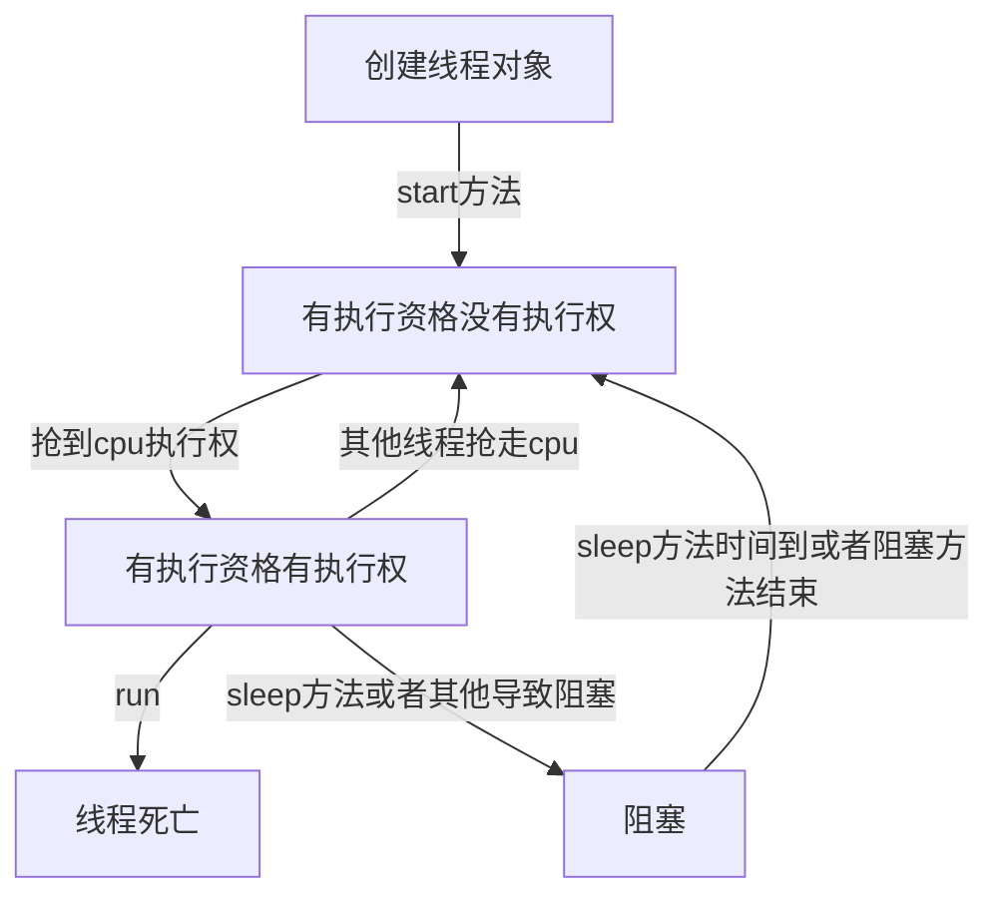

# java.lang

## Object

`notify()` 方法唤醒一个在调用对象的监视器上等待的线程。如果当前线程不是该对象的锁定线程，将抛出 `IllegalMonitorStateException`。

当前线程调用 `notifyAll()` 方法时，它会唤醒在此对象监视器上等待的所有线程。这与 `notify()` 方法不同，后者只唤醒一个等待的线程（如果有的话）。

wait()方法

1. **线程同步**：`wait()` 方法允许线程在某个条件不满足时释放对共享资源的锁定，并让出 CPU 资源给其他线程。
2. **释放锁**：当线程调用 `wait()` 方法时，它会释放当前对象的锁（监视器），并进入等待状态。
3. **超时参数**：`wait()` 方法有一个重载版本，允许你指定一个超时时间。在您提供的代码片段中，`wait(0L)` 调用了一个有参数的 `wait()` 方法，其中 `0L` 表示不指定超时时间，线程将无限期地等待，直到被另一个线程通过 `notify()` 或 `notifyAll()` 方法唤醒。

wait(long)方法

 wait(long,int)毫秒数，纳秒数。

@Deprecated 已经弃用的。

## Thread

```java
import java.long.ref.Reference
import java.long.ref.ReferenceQueue
import java.long.ref.WeakReference    
```

在 Java 中，`java.lang.ref` 包包含了与引用相关的类，这些类支持在垃圾回收时跟踪对象。Java 的 `java.lang.ref` 包中的类主要用于跟踪对象的生命周期，以及在对象不再被引用时执行清理工作，而不必依赖于 `finalize()` 方法的不可靠性。

成员变量

name、priority(优先级)、

daemon 是否为守护进程、interrupted 线程的中断状态——由JVM直接读写

```java
private volatile long eetop;//非零值代表线程存活
```

 private Runnable target；将运行什么；

ThreadGroup group 线程组

ClassLoader ContextClassLoader

static int threadInitNumber 为匿名线程自动编号

/ *

该线程请求的堆栈大小，如果创建者请求了，则为0

*不指定堆栈大小。这取决于VM要做什么

*喜欢这个数字;有些虚拟机会忽略它。

\* /

private final long stack Size;

private final long t id；线程ID 

private static long thread Seq Number; 生成线程ID

private volatile int thread Status；线程状态

volatile Object park Blocker; 线程当前调度 

/*线程在可中断I/O中被阻塞的对象

*操作，如果有的话。应该调用阻塞程序的中断方法

设置此线程的中断状态后。

\* /

```
private volatile Interruptible blocker;
```

`volatile` 是 Java 中的一个关键字，用于声明一个变量在多线程环境中的可见性和禁止指令重排。


## ThreadLocal

提供了线程内的局部变量，每个线程都有变量的一个独立的副本

## ProcessBUilder

允许用户在java应用程序中启动和控制操作系统进程

## reflect

这个是一个在运行时动态获取类的一个api，包括Constructor构造函数,Method方法,Field成员变量,Parameter方法和构造函数的参数。

## invoke

动态调用方法

## constant

包含了一些与常量相关的类和接口。这个包是 Java 9 引入的，旨在提供对常量类型的支持，这些常量类型可以被编译器在编译时解析，从而使得编译器能够执行更多的优化。

ConstantDesc常量描述符

### Method Handles

方法句柄的创建,方法引用，动态调用，方法类型转换

`MethodHandles` 类是 Java 语言对反射和动态代理机制的补充，它为开发者提供了一种更高效、更灵活的方法调用方式，特别是在需要动态处理方法调用的场景中。然而，由于其底层和复杂的特性，建议开发者在充分理解其工作原理和潜在风险后使用。

## module

模块系统是 Java 9 的一个重大特性，旨在使 Java 应用程序更加模块化、灵活和可维护。通过 `java.lang.module` 包中的 API，开发者可以以编程方式与模块系统交互，实现动态模块加载、配置和管理。

## Class

表示正在运行的java应用程序中的接口和类，可以获取类的名称，访问权限，属性等信息。

## ClassLoader

是java中负责动态加载类的类


## Math

提供了一系列数学工具方法

## System

提供了与系统相关的方法，如out，getProperty()获取系统属性等

这个类是一个最终类，但是不能创建对象

他的成员都被静态修饰了不需要创建对象，直接通过类名就能访问

```java
public static void main (String[] args){
	//终止当前java虚拟机，非零表示异常终止。
	System.exit(0);
	//返回当前时间和1970年的毫秒值
    System.currentTimeMillis()*1.0/1000/60/60/24/365
	
}
```

## Throwable

是所有错误或者异常的超类的超类，他提供了描述异常原因的详细信息的方法

e 为异常的对象当java虚拟机抛出这个的异常你捕获到这个异常的对象，

然后你就可以有下列方法来描述

e.printStackTrace();//详细信息

e.getMessage();//返回错误的原因

e.toString();异常类名和错误的原因


## Exception

是上一个Throwable的子类，用于报告程序中的异常情况。

throws 抛出异常后实际上没有处理，而try...catch是处理了

throws 用于方法声明后面，跟的是异常类名。表示抛出异常，由该方法的调用者来处理，表示出现异常的一种可能性，并不一定会发生这些异常

throw 表示抛出异常，由方法体内的语句处理 这个一定是抛出了某种异常。

## RuntimeException

表示程序执行时的异常,这个类及其子类在编译期间不需要检查。

编译时异常被称为受检异常，运行时异常被称为非受检异常

# java.util

## Date类

## simpleDateFormat类

y 年 M 月 d 日 H 时 m 分 s 秒

格式化从Date到String 

format（Date data）

```java
SimpleDateFormat sdf = new SimpleDateFormat("yyyy年MM月dd日 HH:mm:ss");
	Date d = new Date();
    String s = sdf.format(d);
```

解析从String到Date

parse（String source）

```java
SimpleDateFormat sdf = new SimpleDateFormat("yyyy年MM月dd日 HH:mm:ss");
String s = ""; //和上面解析的字符串格式保持一样
sdf.parse(s);
```

## Calendar类（日历类）

```java
//二月天的天数
Calendar c = new Calendar.getInstance();
    c.set(year,2,1)//设置日历对象的年月日
    //由于月份的特殊性，它2其实表示的是三月
    c.add(Calendar.DATE, -1);
	int data = c.get(Calendar.DATE);
```

## Collection(java中集合)

### 集合体系概述

分为collection单列集合，map双列集合。map中的HashMap集合

collection有分为List可重复的。和Set不可重复的 这些集合接口不能具体调用，得通过具体实现类

List有ArrayList集合LinkedList集合 

Set中HashSet TreeSet

### Collection<E> 

E表示集合中的元素类型

```java
Collection<String> c = new ArrayList<String>();
//boolean add(E e) E是String类 e是类实例
c.add("hello"); //返回值永远是true java9
c.sout //输出的是一个可读的对象，说明ArrayList中重写了toString方法
   //这个接口的方法
c.remove(Object 0); boolean
c.clear(); void 清空
c.contains(Object 0) boolean 是否有这个元素
boolean isEmpty();
int size(); 长度
```

### List<E>

有序集合（序列） 存储和取出的顺序一致。允许重复

```java
interface List<E> extends Collection<E>
    void add(int index,E element) 在此集合中的指定位置插入元素
    E remove(int index)  删除指定位置的元素
    E set(int index,E element) 修改指定位置元素，并返回修改的元素
    E get(int index) 返回指定索引处的元素
    
```

Iterator 这个接口这个有一个并发修改异常，原因是在迭代的时候她是不允许其他线程来访问的。

#### 列表迭代器

沿任一方向遍历列表的列表迭代器，可以在迭代的时候增删元素。

在那个add方法已经赋值给了预期值，next方法遍历的时候判断就不会这个预期值和实际值不相同的情况导致抛出异常  。         这个在列表迭代器中就不存在

```java
interface ListIterator<E> extends Iterator<E>
    
```

#### 增强for循环

实现Iterable接口的类允许其对象成为增强型for语句的目标

她是jdk5之后出现的，其内部原理为一个Iterator迭代器 注意并发修改异常

```java
for（元素数据类型 变量名 ：数组或者Collection集合）{

​	在此处使用变量即可，该变量就是元素。

}
```

#### List集合的常用子类

ArrayList查询快，增删慢  底层数据结构是数组（不知道你就用ArrayList）

LinkedList双链表查询慢，增删快。

遍历的三种方式 迭代器，普通for 增强for

### set集合

不包含重复元素的集合 没有带索引的方法，所以不能使用普通for循环

```java
interface Set<E> extends Collection<E>
    
```

#### 哈希值

是jdk根据对象的地址或者字符串或者数字算出来的int类型的数值。

Object类中有一个方法可以获取到对象的哈希值  public int hashCode();

同一个对象多次调用hashCode这个方法返回值是相同的

通过方法重写可以实现不同对象的哈希值是相同的    "字符串"这个是一个对象

#### HashSet<E>

该类底层是哈希表（实际为HashMap实例）实现了Set<E>接口

#### LinkedHashSet<E>

public class LinkedHashSet<E> extends HashSet<E> implements Set<E>

哈希表和链表实现的Set接口，具有可预测的迭代次序。

由链表保证元素有序，也就是说元素的存储和取出顺序是一致的。

#### TreeSet集合

元素有序按照一定的规则排序，具体排序方式取决于构造方法

没有带索引，不能用普通for，

由于是set集合不包含重复元素

public class TreeSet<E> extends AbstractSet<E> implements NavigableSet<E>

interface NavigableSet<E> extends SortedSet<E> 

SortedSet<E> extends Set<E>

构造方法

```java
无参构造，根据其元素的自然排序进行排序a-z
TreeSet(collection<? extends E> c);构造一个包含指定集合中的元素的新树集，根据自然排序
TreeSet(Comparator<? extends E> comparator);构造一个新的空的 根据比较器Comparator

```

#### 自然排序Comparable和比较器排序

让元素所属的类实现Comparable<E>接口，重写CompareTo(To)方法

重写方法时，一定要注意排序的规则必须按照要求的主次条件来写

比较器排序Comparator的使用

# java基础查漏补缺

方法重载，只看方法的名和方法的参数列表，在同一个类中方法名相同但是方法的形参不同，这两个方法就是重载。


方法的参数传递基本类型 ，对应基本数据类型的参数，形式参数的改变，不影响实际参数的值。

```java
public class ArgsDemo1{
    public static void main (String[] args){
        int number =100;
        syso("number:" + number);
        change(number);
        syso("number:" + number);
    }
    public static void change(int number){
        number = 200;
    }
}
```

不会改变的。

方法参数传递的引用类型 ，形式参数的改变，影响实际参数的改变。

基本数据类型 boolean byte short int long float double char 一共八种

比如说，数组是引用类型的，除了非基本数据类型都是引用类型，比如，对象，类实例，接口，异常，集合，枚举，泛型，函数式接口

泛型必须是引用类型的参数

函数式接口

```java
@FunctionalInterface
public interface MathOperation {
    double operation(double a, double b);
}

public class MathOperations {
    public static void main(String[] args) {
        MathOperation addition = (a, b) -> a + b; // Lambda 表达式
        double result = addition.operation(5.0, 3.0);
        System.out.println(result); // 输出 8.0
    }
}
```

构造方法是一个特殊的方法，这个简单但是作为一门面向对象的语言我还是写一下构造方法的结构

```java
public class Student{
    public Student(){
        
    }
}
```

有参的构造方法会消除掉系统默认的无参构造方法，想使用就在写一个无参。


ArrayList java集合框架FrameWork；


子类有自己特有的内容也有父类的内容。

子类的找变量先在方法内部找，内部没有在类中找，类中没有在去被继承的父类中的找。父类没有就报错（没有父亲的父亲这一说）

super表示的是父类的存储空间的标识。this可以访问类内的成员方法，super是父类的成员方法。


继承中访问构造方法，

1.为什么访问子中无参构造方法会访问父中无参构造方法。

2.为什么访问子中有参构造方法会访问父中无参构造方法。

因为子类在构造时，还有可能要有父类的方法或者数据来实现子类，所以子类的构造需要父类先构造。每一个子类构造方法第一个语句都是super()，这种代表无参构造。

如何父类中没有，自己写一个，或者调用父类的带参构造方法。


关于继承中成员方法的调用

先找子类因为你想他就是一个大小关系，子类会更具体。找不到那就父类的都没有就报错。同样不考虑父亲的父亲。


方法的重写

子类出现了与父类一模一样的方法声明

当子类需要父类的功能，而功能主体子类有自己特有的内容时可以重写父类的方法，这样即沿袭了父类的功能，有定义了子类的特有的功能。

@Override 检查重写方法的方法声明正确性

父类中的私有方法子类不可重写

访问修饰符是一直存在的 你不写就是默认的同类，和同包访问。所以你子类的访问权限不要比父类的低。


继承的单一性

只能单一继承，支持多层继承


final这个作用就是不可修改的，不能被二次定义。

变量不能被再次修改。被final修饰的的方法叫做最终方法，不可以被重写。类被修饰就不能被继承。

final修饰基本类型变量这个变量就变成了常量。

 final修饰引用变量 引用类型的地址值不能变，但内容可以变。


## static静态的作用

被所有对象共享的属性用静态修饰，通过类名.变量名就可访问赋值。推荐使用类名调用。

非静态的方法都能访问，无论是否是静态的成员还是方法。

静态修饰的方法只能访问静态属性，和静态方法


多态

同一个对象，在不同时刻表现出来的不同形态。

继承和实现关系

有方法重写

有父类引用指向子类对象

比如说 Animal  a= new Cat();

多态中成员的访问特点

Animal  a= new Cat();

成员变量编译看左边，执行看左边。

成员方法编译看左边，执行看右边

因为成员方法有重写，成员变量没有。

在重写方法的加持下你可以做到调用父类对象指向子类对象从而调用子类方法。但是不能调用非重写方法，这是子类特有的。


多态中的转型

调用父类指向子类对象，从而实现上面的这是向上转型。

在上述中，已经造了一个对象向上转给父类了，我不想在造一个对象来单独访问对象成员了。

这个是向下转型Cat a = (Cat) a;


抽象类 abstract

说白了就是接口，它只负责声明对象，不负责具体的实现

特点，一个拥有抽象方法的类一定是抽象类。抽象类里面不一定都是抽象方法。

你一旦继承了这个抽象方法，你就得重写抽象类中所有的抽象方法。（==除非它本事就是一个抽象类==）

在抽象类中非抽象方法，  会被继承过去，这个不一定对（你实际在那个具体子类中还是重写了继承的方法）。利用多态向上转型你可以访问到这个抽象类的非抽象方法。实际还是访问的具体类。


抽象类特点

包含成员变量 常量 

非抽象方法，提高代码的复用性，通过继承实现。

抽象类，限定子类必须重写完成这些动作。

可以有构造方法，用于子类访问父类（抽象类）	本身不能实例化；


接口我的神 interface

对行为进行规定

==接口就是一种公共的规范标准，java中的接口更多的体现在对行为的抽象==

类和接口之间用实现，也就是implement

==接口中没有成员变量只能是常量  static final修饰==

接口没有构造方法，接口中的方法默认是抽象方法。abstract


类和接口的关系

实现关系，可以单实现，也可以多实现，还可以在继承一个类的同时实现多个接口

接口和接口

单继承也可以多继承


抽象类和接口的区别

成员区别

抽象类    变量，常量；有构造方法，有抽象方法和非抽象方法

接口	常量；抽象方法

设计理念区别，抽象类对类抽象，包括属性，行为；接口只是对行为抽象，主要是行为

抽象类只是一开始设计好的一些具体类会实现的一些方法，比如说灯，开灯，关灯这些动作

而接口是实现一些附加的功能，比如说让这个灯实现声控，让这个通过某种东西进行控制，通过一些额外的接口对灯这个具体类进行改变。发生变化。

抽象类是对事物的抽象，比如动物与猫的关系

接口是对行为的抽象，比如，我开灯的时候我是如何开的，声控，温控。


形参和返回值

抽象类作为形参，返回的是抽象类的子类对象

方法的形参是接口名，其实需要的是该接口的实现类对象


内部类

```java
public class Outer{
    //外部类要访问内部类的成员，必须创建对象
    
    当内部类的访问修饰符成为private
    public class Inner{
        //内部类可以直接访问外部类的成员，包括私有
        public void show(){
            sout;
        }
    }
    public void method(){
        Inner i = new Inner();
        i.show();
    }
}
```
成员内部类如何创建对象使用
```java
public class test{
	public static void main(String[] args){
		Outer.Inner oi = new Outer().new Inter();
		Outer o = new Outer();
		o.method();
	}
}

```
局部内部类
```java
public class Outer{
	private int num = 10;
	public void method(){
		int num2 = 20;
		class Inter{
			public void show(){
				System.out.println(num);
				System.out.println(num2);
			}
		}
		Inter i = new Inter();
		i.show();
	}
}
```

```java
public class test{
	public static void main(String[] args){
		Outer o = new Outer();
		o.method();
	}
}
```
局部内部类是在方法中定义的类，所以外界是无法直接使用的，需要在方法内部创建对象并使用
该类可以直接访问外部类的成员，也可以访问方法内的局部变量。

匿名内部类是局部内部类的一种特殊形式。
==本质是一个继承了该类或者实现了该接口的子类匿名对象==

```java
new Inter(){
	//本质是一个继承了该类或者实现了该接口的子类匿名对象
	//重写方法
	public void show(){
		
	}
}.show();//记得这里有个封号
//这个其实是多态，该接口的子类
Inter i = new Inter(){
	重写方法；
};
```
匿名内部类可以实现一个抽象类子类或者说接口的实现类，不需要在创建一个具体的。
```java
//在java中直接实现
public static void main(String[] args){
	这个是多态直接将引用父类指向子类对象
	jumpping j = new Cat();
	//用匿名内部类
	//我直接调用jo对象中有一个方法它的形参是Jumpping接口
	jo.method(new Jumpping(){
		@Override
		public void jump(){
			System.out.println("猫可以跳高了");
		}
	});
}
```


## 自动装箱和拆箱

在使用包装类的时候只要是对象就在使用前判断一下它是否为空，不然自动拆箱的时候会报空指针异常。

## 可变参数


## 方法引用

什么是方法引用？把已经存在的方法拿过来用，当做函数式接口中的抽象方法的方法体	

::是什么符号？ 是方法引用符

在使用的时候注意什么

需要有函数式接口。2被引用的方法已经存在。3形参和返回值类型必须和抽象方法的形参和返回值类型一致。4被引用的方法要满足需求。

### 方法引用的分类

1.引用静态方法。2引用成员方法。3引用构造方法。

1格式类名::静态方法 例子Integer::parseInt

2格式对象：：成员方法     1其他类对象：：方法名	2本类 this：：方法名	3父类super：：方法名

3格式 类名：：new


其他调用格式

1使用类名：：成员方法 	例子String：：sbustring

==这个方式独有的==	1函数式接口，2被引用方法必须存在 3被应用的方法的形参，需要跟抽象方法的第二个形参到最后一个形参保持一致，返回值需要保持一致。4被引用方法的功能满足当前需求

抽象方法形参的详解：public String apply(String s)

第一个参数String：表示被引用方法的调用者，决定了可以引用哪些类中的方法。在Stream流中，第一个参数一般都是流里面的每一个数据。假设流里面的数据都是字符串，那么使用这种方式进行的方法应用，只能引用String这个类中的方法。

第二个参数到最后一个参数：跟被引用方法的形参保持一致，如果没有第二个参数，说明被引用的方法需要时无参的成员方法

局限性：不能引用所有类中的成员方法。是跟抽象方法中的第一个参数有关，这个参数是什么类型的，那么只能引用这个类中的方法。

2引用数组的构造方法

格式：数据类型[]::new 	范例：int[]::new

细节：数组的类型，需要跟流中数据的类型保持一致。

## 多线程

进程：是程序的基本执行实体

线程：是操作系统能够进行运算调用的最小单位。它被包含在进程之中，是进程中的实际运作单位。

应用软件中互相独立，可以同时运行的功能

并发：在同一时刻，有多个指令在单个cpu上==交替==执行。

并行：在同一时刻有多个指令在多个cpu上==同时==执行。

### 多线程的实现方式

1. 继承thread类的方式进行实现	单继承接口灵活！！

该子类应该重写run方法。接下来可以分配并启动该子类的实例


```java
public class MyThread extends Thread{
 
    @Override
    public void run(){
    	for(int i = 0;i<100;i++){
            
        	getName() + "helloWorld".sout
    	}
    }
   
}
```

启动该子类 

```java
main(String[] args){
	MyThread t1 = new MyThread();
    MyThread t2 = new MyThread();
    t1.setName("线程1");
    t2.setName("线程2");
    
    t1.start();
    }
```

2.  实现Runnable接口的方式进行实现

```java
测试类
    1.自己定义一个类
    2.重写里面的run方法
    3.创建自己的类对象
    4.创建一个Thread类的对象，并开启线程
main(String[] args){
    MyThread mt = new MyThread();
    //
    Thread	t1 = new Thread(mt);
    Thread	t2 = new Thread(mt);
    t1.setName("线程1");
    t2.setName("线程2");
    t1.start();
    t2.start();
}
    
    
    
```

```java
定义的类
public class MyThread implement Runnable{
    @Override
    public void run(){
        //书写线程要执行的代码
        因为没有继承关系不能像上一个直接使用getName()方法。
        获取到当前线程对象
        Thread.currentThread().getName(); 
    }
}
```


3. 利用Callable接口和Future接口方式来实现

   前两种方法没有返回值，该实现可以获取到多线程运行的结果
   
   1. 创建一个类MyCallable实现Callable这个接口
   2. 重写call（是有返回值的，表示多线程执行的结果）
   3. 创建MyCallable的对象（表示多线程要执行的任务）
   4. 创建Future的对象（作用管理多线程运行的结果）接口没有new
   5. 创建Thread的对象（表示线程）并启动
   
   ```java
   public class MyCallable implements Callable<Integer>{
       @Override
       public Integer call() throws Exception{
           int sum = 0;
           for(int i = 1; i<=100; i++){
               sum = sum +i;
           }
           return sum;
       }
   }
   ```
   
   ```java
   public class Test{
       main(){
           Mycallable mc = new MyCallable();
           用这个来管理多线程结果
           FutureTask<Integer> ft = new FutureTask<>(mc);
           Thread t1 = new Thread(ft);
           t1.start();
           ft.get() //返回的结果
       }
   }
   
   ```

### 线程的常见的成员方法

| 方法名称                          | 说明                       |
| :-------------------------------- | -------------------------- |
| String getName()                  |                            |
| void setName(String name)         |                            |
| ==static== Thread currentThread() |                            |
| static void sleep(long time)      | 休眠 单位毫秒              |
| setPriority(int newPriority)      | 设置线程的优先级1-10 默认5 |
| final int getPriority()           | 获取线程的优先级           |
| final void setDaemon(boolean on ) | 设置为守护线程             |
| public static void yield()        | 出让线程/礼让线程          |
| public static void join()         | 插入线程/插队线程          |

```java
测试
public class ThreadDemo{
    main(){
        MyThread t1 = new MyThread("线程名字");这里要有构造方法，在public MyThread(){默认																			有supper}
        MyThread t2 = new MyThread();
        t1.start();
        t1.start();
        默认名字Thread-X 从零开始，也可以用构造方法来设置用super关键词
        当jvm虚拟机启动时会自动的启动多条线程，其中有一条叫做main线程，他的作用就是调用main方法
        Thread.currentThread().getname().sout 所以他就会打印main
        
    }
}
```

### 抢占式调度（优先级）

==随机==java中是抢占式

优先级是概率问题不是他优先级高就一定他先运行完

### 守护线程

当其他的非守护线程执行完毕之后，守护线程也会陆续结束（因为通知需要时间）

应用场景比如一个线程的结束会导致守护进程的结束。

### 礼让线程/出让线程

随机性的线程这样子不好控制

表示出让当前cpu的执行权`Thread.yield();`

插入线程

```java
MyThread t = new MyThread();
t.setName("插入线程");
t.start();
t.join();
//这段代码执行在走这个代码的那个线程中
插入后会保证插入的线程先执行完毕，在往下走
```

### 线程的生命周期



### 线程安全问题

==同步代码块==

把操作共享数据的代码锁起来`synchronized(obj)`，这个obj是一个静态共享唯一的锁对象

```java
public void run(){
    while (true){
        不能放在循环的外面不然整个线程都会循环完这100张票
        synchronized(obj){
            if(ticket < 100){
                try{
                    Thread.sleep();
                }catch(InterruptedException e){
                    e.printStackTrace();
                }
                ticket++;
                "正在买第"+ticket+"张票！！".sout;
                
            }else{
                break;
            }
        }
    }
}
```

锁对象一定是唯一的两个线程看到的锁一定得一样。

`MyThread.class`对象一般来用她是这个文件夹里面的唯一这个类的字节码对象

***


==同步方法==

特点1：同步方法是锁住方法里面所有的代码

特点2：锁对象不能自己指定 	非静态：`this`	静态：当前类的字节码文件对象

lock

```java
static Lock lock = new ReentrantLock();
lock.lock(); 上锁
lock.unlock(); 释放锁

```

```java
while(true){
    lock.lock();
    try{
       if(ticket ==100){
           break;如果没有那个finally，跳出循环的导致程序不会结束
       }else{
           Thread.sleep();
           ticket++;
           ticket.sout
       }
    }catch(InterruptedException e){
        e.printStackTrace();
    }finally{
        lock.unlock();
    }
}
```

***


==生产者和消费者==

这个又叫等待唤醒机制

| 方法名称         | 说明                             |
| ---------------- | -------------------------------- |
| void wait()      | 当前线程等待，直到被其他线程唤醒 |
| void notify()    | 随机唤醒单个线程                 |
| void notifyAll() | 唤醒所有线程                     |


# 数据库事物隔离级别

在单线程中，两个线程访问导致前后数据不一致的问题


脏读，有两个线程，首先第一个事物修改了数据并没有提交，但是第二个线程要的是修改的数据，这时候就可以设置读已提交的数据。

不可重复读，就是一个修改了数据，导致另一个前后查询不一致；

幻影读：针对整张表，有一些数据是整体数据，你插入一条导致另一个事物的数据表条数不一致问题呀。

设置事物隔离级别：读未提交。读已提交解决脏读。可重复读解决可不可重复读问题。串行化解决幻影读。

## MVCC无锁机制

Mvcc多版本并发控制器

在事物隔离级别中只有中间两种用了这种机制一个快照和一个利用指针回滚数据

